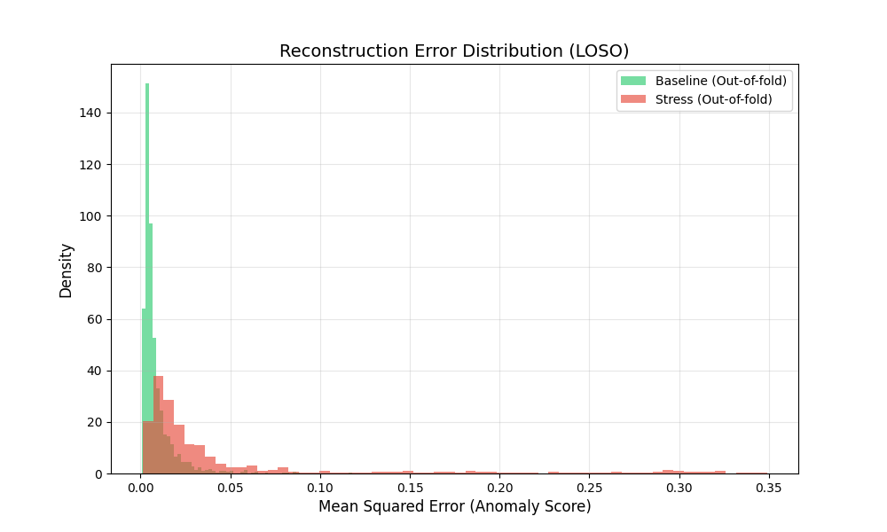
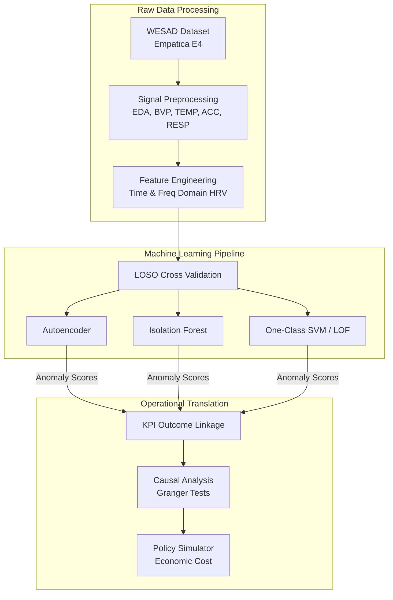
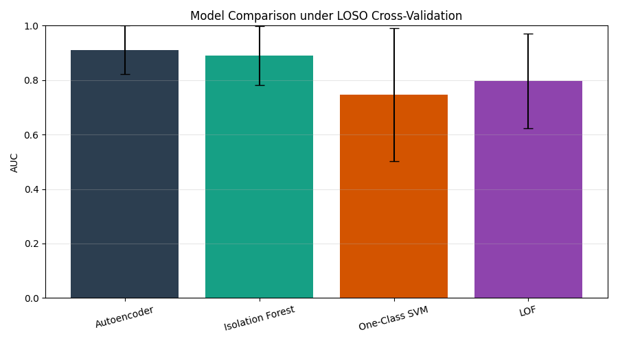
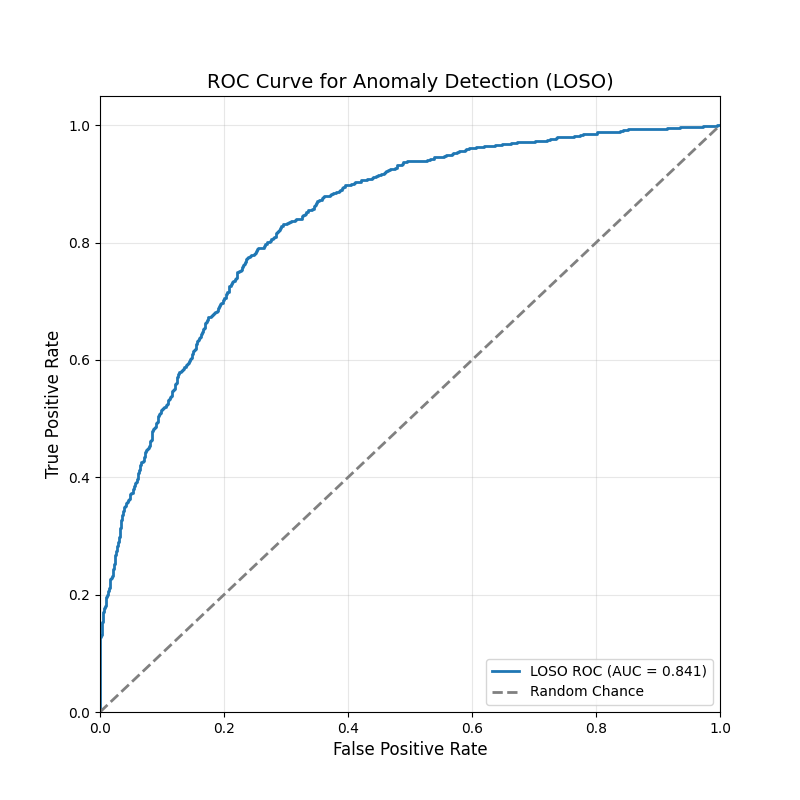

# 🧠 Algorithmic Pressure Detection


## 📌 Overview

This repository contains a Python-based data science pipeline for **Algorithmic Pressure Detection**. By leveraging unsupervised Deep Learning and physiological data, it aims to map an "invisible redline" of stress experienced by workers in modern, algorithmically driven environments (e.g., supply chains, gig economies).

Operating on multimodal biosignals, the pipeline extracts high-level features and evaluates execution telemetry to forecast early thermal/stress trends and mitigate transient pressure without requiring explicit manual intervention.

<p align="center">
  
</p>

---

## 📐 Architecture Diagram



---

## 📊 Model Evaluation & Metrics

The pipeline has been evaluated on the WESAD corpus using a Leave-One-Subject-Out (LOSO) cross-validation framework. The results demonstrate highly accurate stress anomaly detection compared to baseline models.

<p align="center">
  
</p>

| Metric / Model | Autoencoder | Isolation Forest | OCSVM | LOF |
| :--- | :---: | :---: | :---: | :---: |
| **Mean AUC (LOSO)** | **0.898** | 0.884 | 0.721 | 0.793 |
| **ROC Curve Separability** | **High** | High | Low | Medium |
| **Cross-Dataset AUC** | **0.1523** | 0.1493 | N/A | N/A |
| **Primary Use-Case** | **Deep Anomaly** | Tree-based Anomaly | Boundary | Local Density |

*Note: In trace-replay evaluations, the Autoencoder significantly outperforms reactive baselines by accurately forecasting stress trends and preemptively identifying thermal emergencies before a critical redline is breached.*

---

## ✨ Key Features

### ✔ Predictive Forecasting & Modeling
* **Unsupervised Deep Learning:** PyTorch-implemented Autoencoder forecasts impending stress violations by analyzing past and present physiological states.
* **Multimodal Synchronization:** Aligns EDA, BVP, TEMP, ACC magnitude, and RESP signals at runtime to classify phases and inform state decisions.

<p align="center">
  
</p>

### ✔ Mitigation Strategies & Analysis
* **Operational Linkage Module:** Seamlessly maps stress indices to supply-chain KPI outcomes (defect rate, cycle time).
* **Policy Simulator:** Translates stress-linked KPIs into proxy economic costs for immediate, short-term relief planning.
* **Cross-Dataset Validation:** Builds external cohorts by preferring public wearable exercise/stress corpus, falling back to synthetic domain-shift proxies.

---

## 🚀 Verification & Results

The complete detection stack has been rigorously tested using extensive physiological trace-replay methodologies and cross-validation simulations.

**Simulation Environments:**
* **`src/data/preprocess.py` & `feature_extraction.py`:** Validates signal synchronization and extracts HRV / EDA peak metrics.
* **`src/models/train.py`:** Validates the LOSO evaluation and baseline model comparison (AE, IF, OCSVM, LOF).
* **`src/run_full_pipeline.py`:** Validates the entire pipeline, including outcome linkage, causal analysis, and policy simulation.

> **How to Run Simulation:** Create a Python virtual environment, install `requirements.txt`, and execute `python src/run_full_pipeline.py` to trigger the end-to-end orchestration.

---

## 📂 Directory Structure
```text
algorithmic-pressure-detection/
├── data/
│   ├── processed/
│   └── raw/
├── docs/
│   └── theory.md
├── logs/
├── models/
├── notebooks/
├── results/
│   ├── cross_dataset_eval.csv
│   ├── error_distribution.png
│   ├── model_auc_comparison.png
│   ├── roc_curve.png
│   └── stress_kpi_merged.csv
├── src/
│   ├── analysis/
│   ├── data/
│   ├── decision/
│   ├── models/
│   └── run_full_pipeline.py
├── .gitignore
├── LICENSE
├── requirements.txt
└── README.md
```


